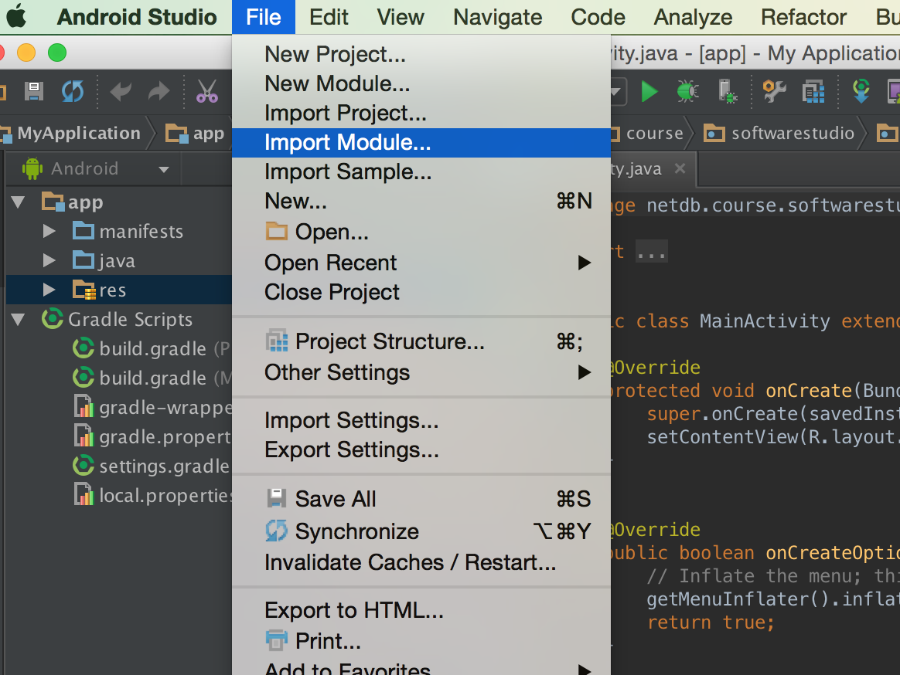
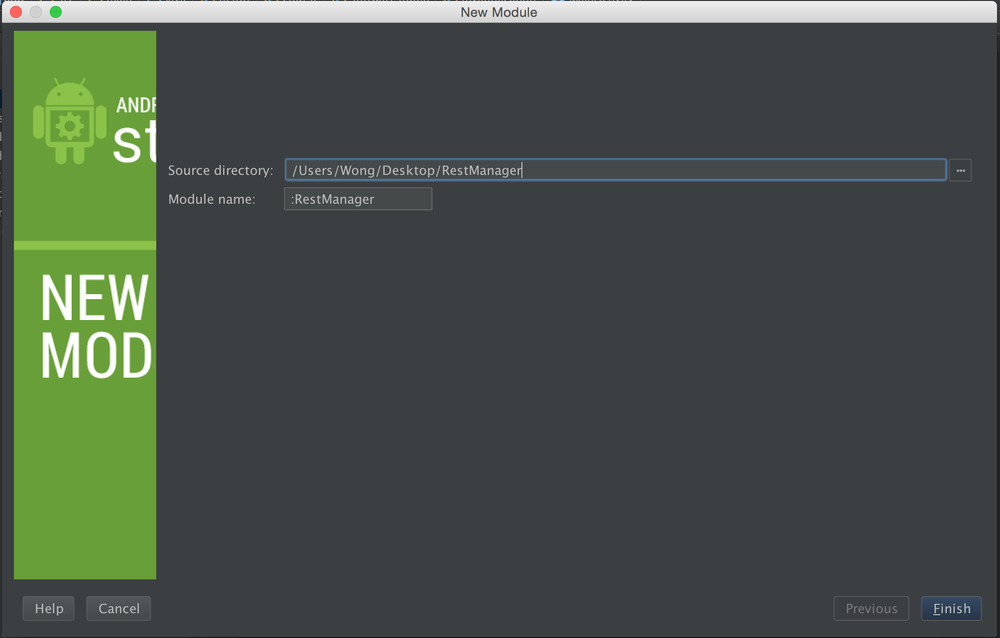
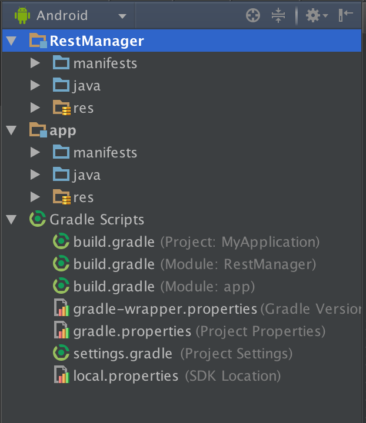
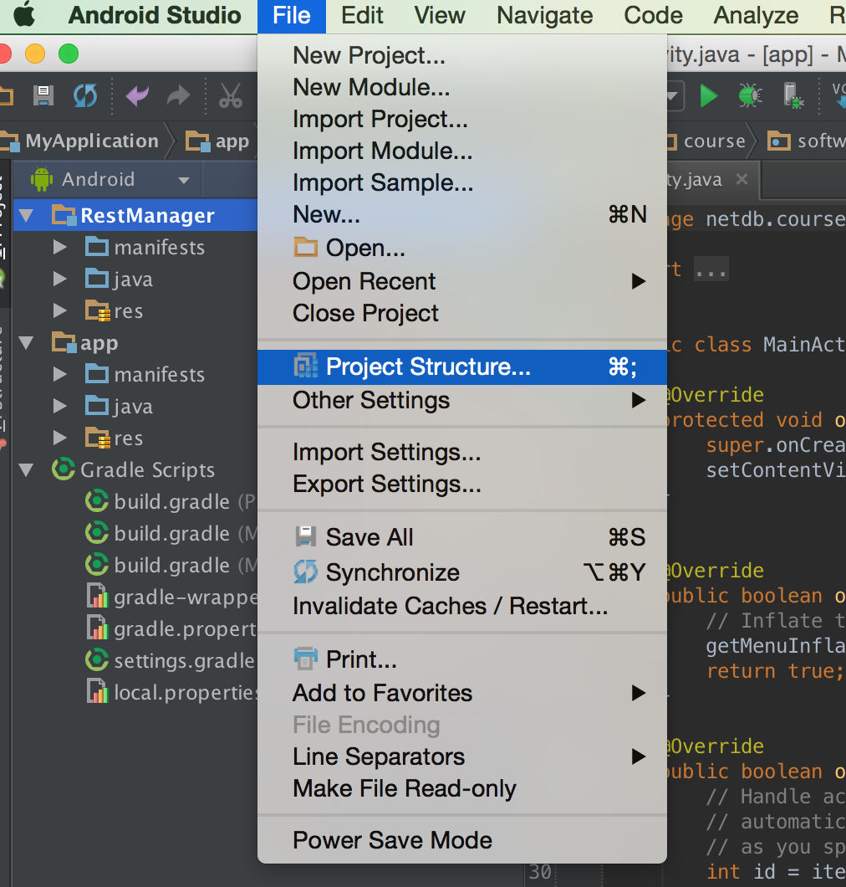
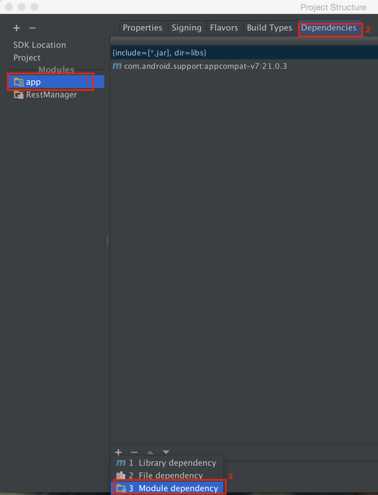
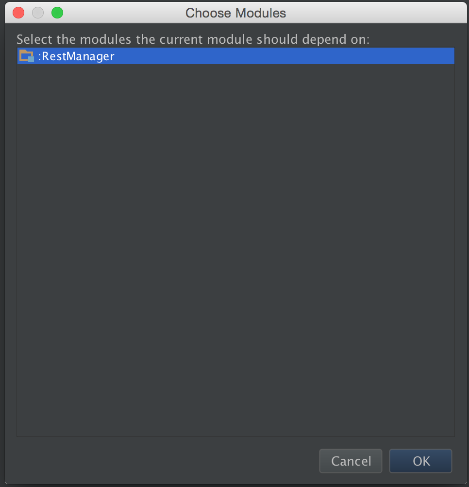
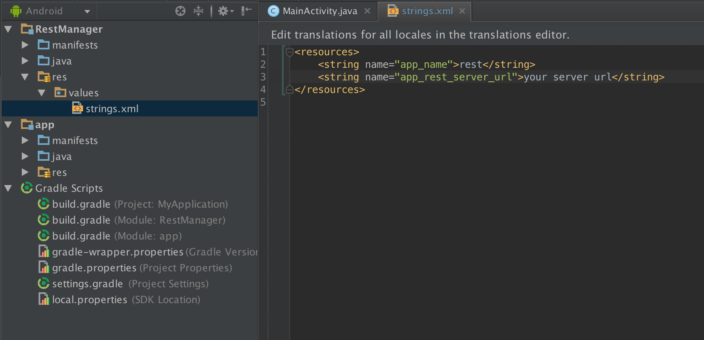

# How to Use RestManger

## Import
1. Clone or download .zip of this project.
2. Import it as a module in your project.  
3. Your project will be like this. 
4. Set your project structure. 
5. Add a library module dependency to your `app` module 
6. Select `RestManager` 

## Specify Your Server URL
Add *your server URL* to the string resource `res/strings.xml` of the module of `RestManager`. 

## Methods
* **GET /resource** - `getResource()`
* **GET /resource/:id** - `listResource()`
* **POST /resource** - `postResource()`
* **PUT /resource/:id** - `putResource()`
* **DELETE /resource/:id** - `deleteResource()`

## Example
If we have a `User` resource which has 3 fields

* `name`
* `age`
* `nickname`

and the `nickname` is a field which can be update in future.

Then, we can define a class to model our resource like this:

```java
public class User extends Resource {

	private String name;
	private Integer age;
	@Putable
	private String nickname;

	public User(String name, Integer age){
		this.name = name;
		this.age = age;
	}
	
	public void setNickname(String nickname){
		this.nickname = nickname;
	}	

	public static String getCollectionName() {
		return "users";
	}
}
```

**[IMPORTANT]** The class must be a subclass of `Resource`, and have `getCollectionName` method.

---

We need the instance of RestManager before using it. You can get the instance in `onCreate` method. Like this:

```java
public class MainActivity extends ActionBarActivity {

	private RestManager restMgr;
	
	@Override
	protected void onCreate(Bundle savedInstanceState) {
		super.onCreate(savedInstanceState);
		setContentView(R.layout.activity_main);

		restMgr = RestManager.getInstance(this);
		
	}
}
```

---

Get a user whose id is `1` (GET /users/1):

```java
restMgr.getResource(User.class, "1", new RestManager.GetResourceListener<User>() {
	@Override
	public void onResponse(int code, Map<String, String> headers, User resource) {
		// Do something, if response is 2XX
		// The parameter resource is the response data
	}
	@Override
	public void onRedirect(int code, Map<String, String> headers, String url) {
		// Do something, if response is 3XX
	}
	@Override
	public void onError(String message, Throwable cause, int code, Map<String, String> headers) {
		// Do something, if response is 4XX
	}
}, TAG);
```

* The 1st parameter is the **model class** of the resource. (such as `User.class`)
* The 2nd parameter is the **id** of the resource you want to get. (such as `"1"`)
* The 3rd parameter is the **listener** for response.
* The 4th parameter is the **string** as tag for logging. (such as `"MainActivity"`)

---
Get all of the users (GET /users):

```java
Map<String, String> param = new HashMap<String, String>();
param.put("sort", "desc");
restMgr.listResource(User.class, param, new RestManager.ListResourceListener<User>() {
	@Override
	public void onResponse(int code, Map<String, String> headers, List<User> resources) {
		// Do something, if response is 2XX
		// The parameter resources is the response data
	}
	@Override
	public void onRedirect(int code, Map<String, String> headers, String url) {
		// Do something, if response is 3XX
	}
	@Override
	public void onError(String message, Throwable cause, int code, Map<String, String> headers) {
		// Do something, if response is 4XX
	}
}, TAG);
```
* The 1st parameter is the **model class** of the resource. (such as `User.class`)
* The 2nd parameter is the **parameter** of this request. (such as `?sort=desc`)
* The 3rd parameter is the **listener** for response.
* The 4th parameter is the **string** as tag for logging. (such as `"MainActivity"`)

---
Post a user (POST /users):

```java
User user = new User("Brandon", 18);
restMgr.postResource(User.class, user, new RestManager.PostResourceListener() {
	@Override
	public void onResponse(int code, Map<String, String> headers) {
		// Do something, if response is 2XX
	}
	@Override
	public void onRedirect(int code, Map<String, String> headers, String url) {
		// Do something, if response is 3XX
	}
	@Override
	public void onError(String message, Throwable cause, int code, Map<String, String> headers) {
		// Do something, if response is 4XX	}
}, TAG);
```
* The 1st parameter is the **model class** of the resource. (such as `User.class`)
* The 2nd parameter is the **instance** of the resource you want to create.
* The 3rd parameter is the **listener** for response.
* The 4th parameter is the **string** as tag for logging. (such as `"MainActivity"`)

The request body will like this:

```json
{
	"name": "Brandon",
	"age": 18,
	"nickname": null
}
```

---
Put a user whose id is `1` (PUT /users/1):

```java
user.setNickname("Professor");
restMgr.putResource(User.class, null, new RestManager.PutResourceListener() {
	@Override
	public void onResponse(int code, Map<String, String> headers) {
		// Do something, if response is 2XX
	}

	@Override
	public void onRedirect(int code, Map<String, String> headers, String url) {
		// Do something, if response is 3XX
	}

	@Override
	public void onError(String message, Throwable cause, int code, Map<String, String> headers) {
		// Do something, if response is 4XX
	}
}, TAG);
```

The request body will like this:

```json
{
	"nickname": "Professor"
}
```